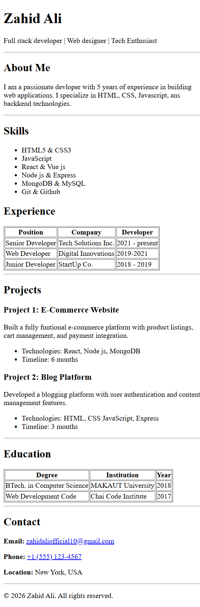

# HTML Resume

This project is a personal resume website created using pure HTML.  
It presents personal information, education, skills, and contact details in a structured and readable format.

## Live Demo
🔗 https://zahid-ali10.github.io/HTML-resume/

## Screenshot

## Features
- Clean and simple resume layout
- Structured using semantic HTML elements
- Easy to read and customize
- Beginner-friendly project

## Technologies Used
- HTML5

## How to Run Locally
1. Clone or download the repository
2. Open `index.html` in any web browser

## Project Purpose
This project was built to practice core HTML concepts such as:
- HTML tags and elements
- Headings, lists, and links
- Basic page structure

## Author
Zahid Ali
